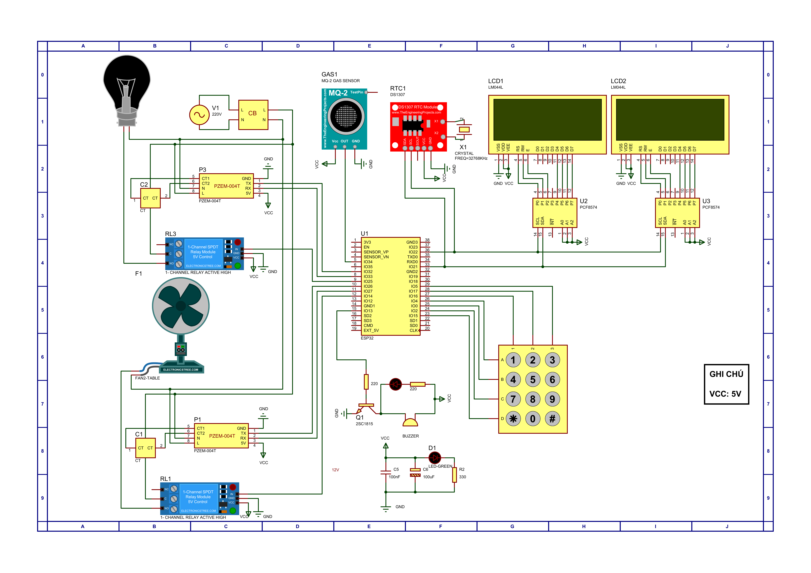

# IoT-based Energy Monitoring and Control System

This project presents a complete IoT-based smart energy monitoring system that tracks the power consumption of electrical devices in real-time using an ESP32 microcontroller, PZEM-004T sensors, and an LCD display. It allows users to receive live data and safety alerts via the E-Ra IoT platform and mobile app.

## 📌 Project Overview

- **Objective:** Design and implement a real-time electrical monitoring system with IoT connectivity.
- **Platform:** Arduino IDE, Proteus, E-Ra IoT Platform
- **Target Users:** Households, small offices, academic purposes
- **Connectivity:** Wi-Fi (ESP32), UART, I2C

## 🧰 Hardware Components

| Component                | Description                                          |
|--------------------------|------------------------------------------------------|
| ESP32 DevKit V1          | Central microcontroller with Wi-Fi capability       |
| PZEM-004T (100A) x2      | AC power monitoring modules                         |
| LCD 20x4 I2C x2          | Real-time visual display of electrical values       |
| MQ-2 Gas Sensor          | Detects gas leaks and smoke                         |
| DS1307 RTC Module        | Real-time clock for time-stamping                  |
| 3x4 Keypad Matrix        | User input for limit settings                       |
| Buzzer                   | Sound alert for threshold violations                |
| Relay Module x2          | Controls connected electrical devices               |
| LM2596 Power Module      | Buck converter for voltage regulation               |

## 🔌 System Schematic

Below is the system schematic that illustrates all hardware connections:

## 📈 Features

- **Real-time Monitoring:**
  - Voltage (V), Current (A), Power (W), and Energy (kWh)
  - Independently monitor two electrical devices simultaneously

- **Electricity Cost Calculation:**
  - The system automatically calculates and estimates daily and monthly electricity costs based on energy consumption.

- **Smart Alerts:**
  - Detects over-voltage and over-power conditions
  - Activates buzzer and LED alerts
  - Sends notifications via mobile app and email

- **Gas Detection:**
  - MQ-2 sensor detects gas/smoke leakage
  - Automatically shuts off power to devices via relay for safety

- **User Interaction:**
  - Keypad allows users to set safe voltage and power thresholds
  - LCDs display all measurements clearly and continuously

- **Remote Control:**
  - E-Ra IoT platform allows remote monitoring and control
  - Relays can be toggled manually or automatically via cloud

## 📱 IoT Integration

- **Platform:** E-Ra IoT
- **Functionality:**
  - Uploads sensor data to cloud via Wi-Fi
  - Dashboard displays live readings
  - Triggers alerts on fault detection

## 🖥️ Software

- **Firmware:** Written in Arduino (C++) for ESP32
- **Simulation & PCB:** Proteus 8
- **Cloud App:** Configured via E-Ra IoT Dashboard

## 🚀 Getting Started

### Prerequisites

- ESP32 board
- Arduino IDE with ESP32 board package
- Required libraries:
  - `Arduino.h`
  - `ERa.hpp`
  - `PZEM004Tv30.h`
  - `Wire.h`
  - `LiquidCrystal_I2C.h`
  - `RTClib.h`
  - `Keypad.h`
  - `EEPROM.h`

### Installation

1. Open `ESP32.ino` in Arduino IDE.
2. Install required libraries via Library Manager.
3. Set your Wi-Fi credentials and API keys (E-Ra platform).
4. Upload the code to ESP32.
5. Assemble hardware based on the schematic image.

## 📝 License

This project is developed for academic and educational use. For collaboration or reuse, please contact the authors.

